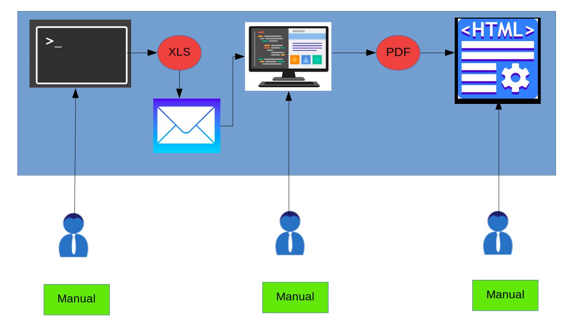
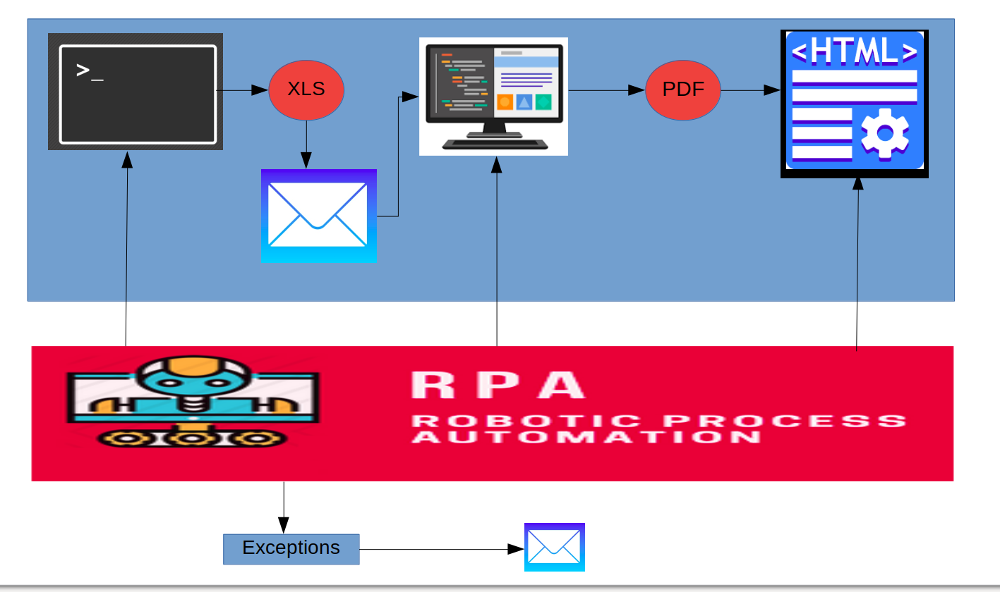

# Payslip Generation automation :

Payslip Generation automation is a proof of concept developed to show how RPA can automate manual, tedious and time consuming payslip generation tasks efficiently. We used UIPath (https://www.uipath.com/) Freed Edition to develop this POC. 

> In this POC we demonstrated how to automate business scenarios that involves command line, desktop, web applications in single workflow using UIPath RPA tool

As part of this POC we developed fictitious payslip generation application that has many manual steps. We developed RPA scripts against this fictitious application to automate manual steps. 

At High Level Payslip Generation application contains following 3 subsystems
           
           * XLS Generator CommandLine App
           * Payslip PDF generation Desktop App
           * Payslip Main Sender Web App
 
 #### XLS Generator CommandLine App :
  This app is a simple jar file with main class which generates XLS file with employee payroll details. Upon execution this  
  app generates XLS with all employee payroll details
 
 #### Payslip PDF generation Desktop App :
  This app is desktop application developed in java swing. This app contains simple form to enter employeed payroll details   
  and generate PDF.
 
 #### Payslip Main Sender Web App :
  This app is a web application developed in Angular that allows users to upload payslip pdf. Once PDF uploaded it sends 
  payslip pdf to employee email .

### Before Automation :
 

 Before automation payslip generation involves following manual steps
           - Invoke command line application to generate XLS file with payroll information
           - Payroll XLS file is sent to HR department
           - One employee go through each record XLS file and uploads details to desktop application to generate payslip PDF
           - Generated payslip PDF is uploaded webapp
           
  ###### Problems :
           - Time consuming due to many manual steps involved 
           - Not scalable for large number of records
           - High chance for introducing errors 
           - Employee dissatisfaction due to boring work
 
### After Automation : 
 

 After automation all manual steps got eliminated. Automation keep track of status for each record and 
 email XLS with status information to administrator at the end of the flow. Administrator can review the status file and    
 manually correct any failed records.
 
  ###### Benefits:
           - No more manual steps. All steps are automated end to end
           - Scalable process can be applied to any number of records since everything automated
           - No Chance for manual errors since everything automated
           - No more employee dissatisfaction since we can repurpose employee's to some other valueble work

 # How to Setup and Run :
           - Ensure Java and Node.js installed in PC
           - Clone the project
           - Double click the Main.xaml file
           - Internally, this uses the below mail credentials
                      - Mail Id : prokarma.no.reply@gmail.com
                      - Password :  Prokarma@2018

 
